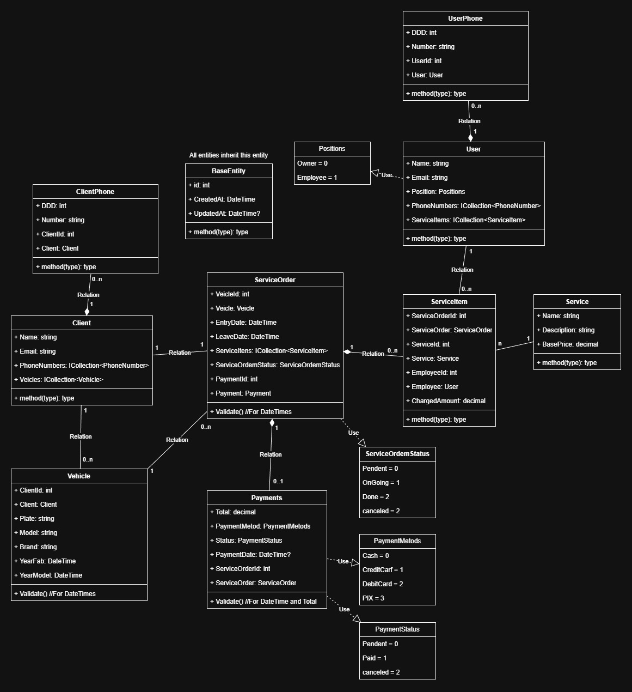

# Projeto – Aplicação Windows Forms (.NET Framework 4.8)

[](https://dotnet.microsoft.com/)
[](https://docs.microsoft.com/en-us/ef/ef6/)

Este repositório contém uma aplicação desktop desenvolvida em **Windows Forms**, utilizando **.NET Framework 4.8**, com **Entity Framework 6** para persistência de dados em **SQL Server** (cloud ou LocalDB para desenvolvimento).

---

## Tecnologias Principais

* **.NET Framework 4.8**

  * Windows Forms
* **Entity Framework 6**

  * Configuração via Fluent API e Data Annotations
* **SQL Server**

  * Banco remoto ou LocalDB para desenvolvimento e testes

---

## Objetivo do Projeto

Criar uma aplicação desktop com persistência de dados via EF6, oferecendo funcionalidades para gerenciar clientes, veículos, ordens de serviço e pagamentos. O design modular permite evoluções futuras, incluindo novos módulos ou integração com serviços externos.

---

## Status do Projeto

O projeto está em fase inicial de desenvolvimento. Atualizações e melhorias serão documentadas no histórico do repositório.

---

## Diagrama Atual



---

## Estrutura Inicial (planejada)

```
src/        – Código-fonte da aplicação
Data/       – Contexto EF, mapeamentos (Configurations) e Migrations
Docs/       – Documentação técnica e didática (EF, arquitetura)
README.md   – Informações gerais do projeto
```

---

## Documentações Adicionais

* [Introdução ao Entity Framework 6](CarWashSystem/Docs/EntityFramework/01_Introducao.md)</br>
├── [01_Introducao.md](./01_Introducao.md) — este documento.</br>
├── [02_Modelos.md](./02_Modelos.md) — entidades, propriedades e convenções básicas.</br>
├── [03_Conventions.md](./03_Conventions.md) — convenções do EF6 (naming, chaves, relacionamentos automáticos).</br>
├── [04_FluentAPI.md](./04_FluentAPI.md) — introdução ao Fluent API.</br>
│   ├── [01_Configuracoes-Entidades.md](./04_FluentAPI/01_Configuracoes-Entidades.md) — exemplos de `EntityTypeConfiguration<T>`.</br>
│   ├── [02_Relacionamentos.md](./04_FluentAPI/02_Relacionamentos.md) — 1:N, N:1, 0..1:1, N:N com exemplos.</br>
│   ├── [03_CascadeDelete.md](./04_FluentAPI/03_CascadeDelete.md) — regras e boas práticas sobre exclusão em cascata.</br>
│   └── [04_Resumo-FluentAPI.md](./04_FluentAPI/04_Resumo-FluentAPI.md) — resumo visual e referências rápidas.</br>
├── [05_Migrations.md](./05_Migrations.md) — uso de migrations no EF6.</br>
├── [06_Initializers.md](./06_Initializers.md) — inicializadores de banco e `Seed`.</br>
├── [07_LocalDB.md](./07_LocalDB.md) — configurar e usar LocalDB para desenvolvimento e testes.</br>
└── [08_Boas-Praticas.md](./08_Boas-Praticas.md) — recomendações gerais e anti-patterns.</br>
* [Test](CarWashSystem/Docs/EntityFramework/01_Introducao.md)

---

## Nota sobre este material

Documento e estrutura preparados para uso com **.NET Framework 4.8 e Entity Framework 6**.
Documentação gerada com auxílio de IA — revisar e adaptar ao seu contexto é recomenda
