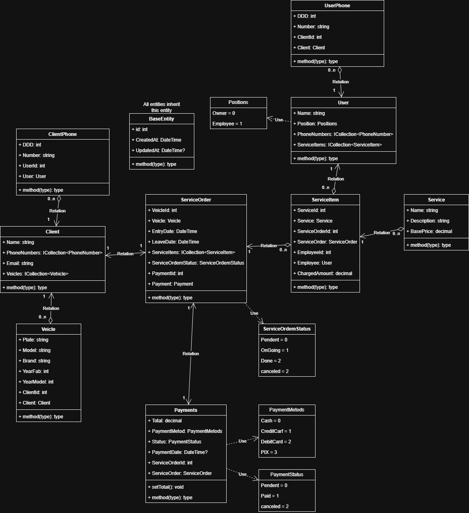

# Projeto – Aplicação Windows Forms (.NET Framework 4.8)

Este repositório contém uma aplicação baseada em Windows Forms, utilizando .NET Framework 4.8, integrada com Entity Framework 6 para acesso a dados. O projeto utilizará um SQL Server hospedado em cloud (provedor a definir).

## Tecnologias Principais

- .NET Framework 4.8
- Windows Forms
- Entity Framework 6 (EF6)
- SQL Server (cloud)

## Objetivo do Projeto

Criar uma aplicação desktop utilizando Windows Forms, com persistência de dados via Entity Framework e banco SQL Server remoto. Mais detalhes e módulos serão definidos conforme o desenvolvimento avança.

## Status do Projeto

O projeto acaba de ser iniciado e ainda será atualizado.

Current Diagram

## Estrutura Inicial (planejada)

- src/ – Código-fonte da aplicação
- Data/ – Contexto do EF, Mapeamentos e Migrations
- Docs/ – Documentação adicional
- README.md – Informações gerais do projeto
